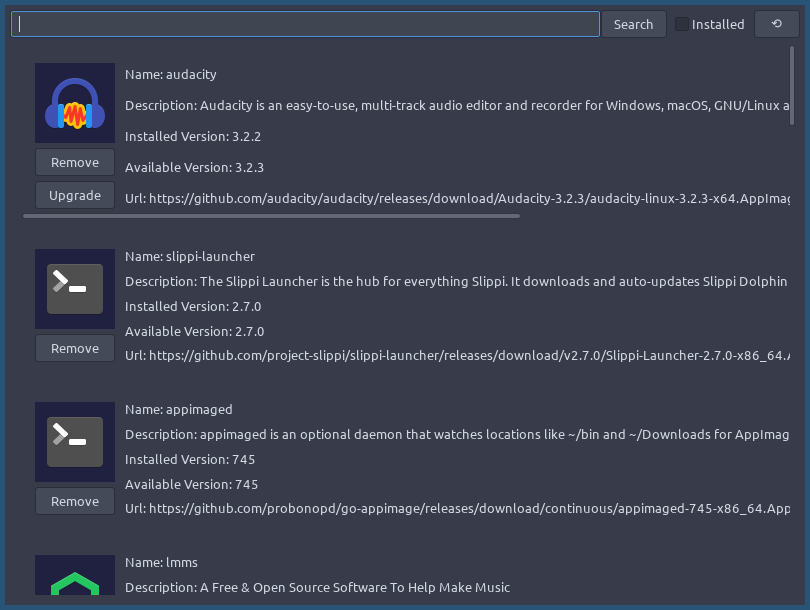

# The AppImage Store -er (aipster)

## Description

A graphical store of sort for downloading AppImages from the aip-man [global package list](https://github.com/blueOkiris/aip-man-pkg-list). It acts a front-end for the [AppImage package manager](https://github.com/blueOkiris/aip-man).

## Building

It's Rust so `cargo build --release`

You can also install from crates.io

Dependencies:
- gtk4.0 devel
- graphene devel
- pkg-config
- aipman

